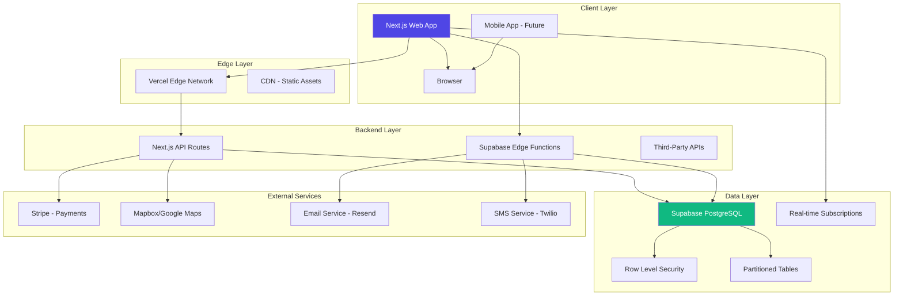
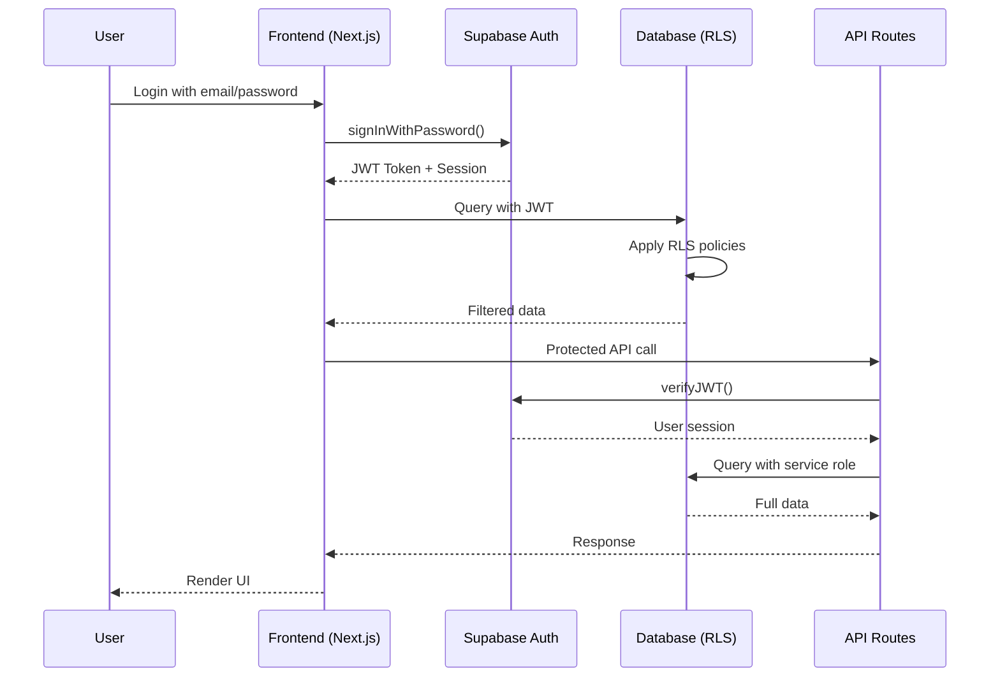

# Software Architecture - Funeral Service SaaS Platform

## Architecture Overview Diagram



## Detailed Architecture Components

1. Frontend Architecture (Next.js - App Router)

```text
src/
├── app/
│   ├── (public)/           # Public pages
│   │   ├── landing/
│   │   ├── search/
│   │   └── page.tsx
│   ├── (auth)/            # Authentication pages
│   │   ├── login/
│   │   ├── register/
│   │   └── layout.tsx
│   ├── (customer)/        # Customer dashboard
│   │   ├── dashboard/
│   │   ├── bookings/
│   │   ├── profile/
│   │   └── layout.tsx
│   ├── (provider)/        # Service provider dashboard
│   │   ├── dashboard/
│   │   ├── services/
│   │   ├── reservations/
│   │   └── layout.tsx
│   ├── (admin)/           # Admin dashboard
│   │   ├── dashboard/
│   │   ├── organizations/
│   │   └── layout.tsx
│   ├── api/               # Next.js API Routes
│   │   ├── webhooks/
│   │   ├── admin/
│   │   └── auth/
│   └── layout.tsx         # Root layout
├── components/
│   ├── ui/               # shadcn/ui components
│   ├── forms/            # Form components (RHF + Zod)
│   ├── maps/             # Map components
│   ├── dashboard/        # Dashboard widgets
│   ├── providers/        # Context providers
│   └── shared/           # Shared components
├── lib/
│   ├── supabase/         # Supabase client config
│   ├── utils/            # Utility functions
│   ├── validators/       # Zod schemas
│   ├── constants/        # Constants & config
│   └── types/            # TypeScript types
├── hooks/                # Custom React hooks
├── proxy.ts              # Next.js proxy
└── utils/                # Utility functions
```

### Key Frontend Technologies:

1. Next.js with App Router for file-based routing
2. TypeScript for type safety
3. Tailwind CSS for styling
4. shadcn/ui for component library
5. React Hook Form + Zod for form handling
6. TanStack Query for server state management
7. React Context / Zustand for client state
8. Mapbox GL JS / Google Maps API for maps
9. Stripe.js for payment processing
10. React PDF / @react-pdf/renderer for PDF generation

2. Backend Architecture (Supabase + Next.js API Routes)

### Supabase Configuration:

```typescript
// lib/supabase/client.ts
import { createClient } from '@supabase/supabase-js'

const supabaseUrl = process.env.NEXT_PUBLIC_SUPABASE_URL!
const supabaseAnonKey = process.env.NEXT_PUBLIC_SUPABASE_ANON_KEY!

export const supabase = createClient(supabaseUrl, supabaseAnonKey, {
  auth: {
    autoRefreshToken: true,
    persistSession: true,
    detectSessionInUrl: true
  },
  db: {
    schema: 'public'
  },
  global: {
    headers: { 'x-application-name': 'funeral-service-platform' }
  }
})

// Server-side client
export const supabaseServer = (accessToken?: string) => {
  return createClient(
    process.env.NEXT_PUBLIC_SUPABASE_URL!,
    process.env.SUPABASE_SERVICE_ROLE_KEY!,
    {
      auth: {
        autoRefreshToken: false,
        persistSession: false
      },
      global: {
        headers: {
          Authorization: accessToken ? `Bearer ${accessToken}` : ''
        }
      }
    }
  )
}
```

### Next.js API Routes Structure:

```typescript
// app/api/bookings/route.ts
import { NextRequest, NextResponse } from 'next/server'
import { createRouteHandlerClient } from '@supabase/auth-helpers-nextjs'
import { cookies } from 'next/headers'
import { z } from 'zod'

const bookingSchema = z.object({
  serviceId: z.string().uuid(),
  locationId: z.string().uuid(),
  scheduledDate: z.string().date(),
  deceasedPerson: z.object({
    fullName: z.string(),
    dateOfBirth: z.string().date(),
    dateOfDeath: z.string().date()
  })
})

export async function POST(request: NextRequest) {
  try {
    const supabase = createRouteHandlerClient({ cookies })
    
    // Check authentication
    const { data: { session } } = await supabase.auth.getSession()
    if (!session) {
      return NextResponse.json({ error: 'Unauthorized' }, { status: 401 })
    }
    
    // Validate input
    const body = await request.json()
    const validatedData = bookingSchema.parse(body)
    
    // Create booking
    const { data: booking, error } = await supabase
      .from('reservations')
      .insert({
        user_id: session.user.id,
        ...validatedData,
        status: 'pending',
        reference_number: `RSV-${Date.now()}-${Math.random().toString(36).substr(2, 9)}`
      })
      .select()
      .single()
    
    if (error) throw error
    
    return NextResponse.json({ booking })
  } catch (error) {
    return NextResponse.json(
      { error: error instanceof Error ? error.message : 'Unknown error' },
      { status: 400 }
    )
  }
}
```

3. Database Architecture (Supabase PostgreSQL)

3.1 Database Layer Components:

```text
PostgreSQL Database
├── Tables (40+ tables with RLS)
├── Views
├── Functions (Stored Procedures)
├── Triggers
├── Indexes (B-tree, GIN, GIST)
└── Extensions (PostGIS, pg_partman, pgcrypto)
```

3.2 Database Connection Flow:

```typescript
// Example of database operations with RLS
async function getOrganizationReservations(orgId: string, userId: string) {
  // This query automatically respects RLS policies
  const { data, error } = await supabase
    .from('reservations')
    .select(`
      *,
      services:reservation_services(
        service:services(*),
        pricing_plan:pricing_plans(*)
      ),
      location:locations(*),
      customer:users!reservations_user_id_fkey(
        id,
        full_name,
        email,
        phone
      )
    `)
    .eq('organization_id', orgId)
    .order('created_at', { ascending: false })
    .range(0, 49)
  
  // RLS automatically filters based on user's permissions
  return { data, error }
}
```

3.3 Real-time Subscriptions:

```typescript
// Real-time updates for dashboard
useEffect(() => {
  const channel = supabase
    .channel('reservations-channel')
    .on(
      'postgres_changes',
      {
        event: 'INSERT',
        schema: 'public',
        table: 'reservations',
        filter: `organization_id=eq.${organizationId}`
      },
      (payload) => {
        // Update UI with new reservation
        addNewReservation(payload.new)
      }
    )
    .subscribe()

  return () => {
    supabase.removeChannel(channel)
  }
}, [organizationId])
```

4. Supabase Edge Functions Architecture

### Edge Functions Structure:

```text
supabase/
├── functions/
│   ├── process-payment/
│   │   ├── index.ts
│   │   └── config.toml
│   ├── generate-invoice/
│   │   ├── index.ts
│   │   └── config.toml
│   ├── send-notification/
│   │   ├── index.ts
│   │   └── config.toml
│   └── sync-maps-data/
│       ├── index.ts
│       └── config.toml
```

### Example Edge Function:

```typescript
// supabase/functions/process-payment/index.ts
import { serve } from 'https://deno.land/std@0.168.0/http/server.ts'
import Stripe from 'https://esm.sh/stripe@12.0.0'
import { createClient } from 'https://esm.sh/@supabase/supabase-js@2'

const stripe = new Stripe(Deno.env.get('STRIPE_SECRET_KEY')!, {
  apiVersion: '2023-10-16',
})

const corsHeaders = {
  'Access-Control-Allow-Origin': '*',
  'Access-Control-Allow-Headers': 'authorization, x-client-info, apikey, content-type',
}

serve(async (req) => {
  if (req.method === 'OPTIONS') {
    return new Response('ok', { headers: corsHeaders })
  }

  try {
    const { reservationId, paymentMethodId } = await req.json()
    
    const supabaseClient = createClient(
      Deno.env.get('SUPABASE_URL')!,
      Deno.env.get('SUPABASE_SERVICE_ROLE_KEY')!
    )

    // Get reservation details
    const { data: reservation } = await supabaseClient
      .from('reservations')
      .select('*, organization:organizations(stripe_account_id)')
      .eq('id', reservationId)
      .single()

    // Create Stripe payment intent
    const paymentIntent = await stripe.paymentIntents.create({
      amount: Math.round(reservation.total_amount * 100),
      currency: reservation.currency,
      payment_method: paymentMethodId,
      confirm: true,
      customer: reservation.stripe_customer_id,
      metadata: {
        reservation_id: reservationId,
        organization_id: reservation.organization_id
      }
    })

    // Update reservation status
    await supabaseClient
      .from('reservations')
      .update({ 
        status: 'confirmed',
        payment_status: 'completed'
      })
      .eq('id', reservationId)

    return new Response(
      JSON.stringify({ 
        success: true, 
        paymentIntentId: paymentIntent.id 
      }),
      { 
        headers: { ...corsHeaders, 'Content-Type': 'application/json' },
        status: 200 
      }
    )
  } catch (error) {
    return new Response(
      JSON.stringify({ error: error.message }),
      { 
        headers: { ...corsHeaders, 'Content-Type': 'application/json' },
        status: 400 
      }
    )
  }
})
```

5. Authentication & Authorization Flow



6. Data Flow Architecture

### User Registration Flow:

```text
1. User submits registration form
2. Frontend → Supabase Auth (signUp)
3. Supabase creates user + sends verification email
4. User verifies email
5. Supabase triggers database function
6. Function creates customer_profile record
7. Real-time subscription updates UI
```

### Booking Process Flow

```text
1. Customer searches services/locations
2. Selects services + pricing plan
3. Enters deceased person details
4. Submits booking (draft status)
5. System checks availability
6. Customer proceeds to payment
7. Stripe processes payment
8. Webhook updates reservation status
9. Notifications sent to all parties
10. Documents generated (PDF)
```

### Real-time Updates:

```typescript
// WebSocket connections for real-time features
const setupRealTimeSubscriptions = (userId: string) => {
  // Reservation updates
  supabase
    .channel(`user-${userId}-reservations`)
    .on('postgres_changes', 
      { event: '*', schema: 'public', table: 'reservations' },
      handleReservationUpdate
    )
  
  // Chat/messages
  supabase
    .channel(`user-${userId}-messages`)
    .on('postgres_changes',
      { event: 'INSERT', schema: 'public', table: 'messages' },
      handleNewMessage
    )
  
  // Notifications
  supabase
    .channel(`user-${userId}-notifications`)
    .on('postgres_changes',
      { event: 'INSERT', schema: 'public', table: 'notifications' },
      handleNewNotification
    )
}
```

7. Security Architecture

1. Network Layer:

- Vercel HTTPS enforcement
- Supabase SSL connections
- Firewall rules

2. Application Layer:

- Next.js middleware for auth
- Rate limiting on API routes
- Input validation (Zod)
- XSS/CSRF protection

3. Database Layer:

- Row Level Security (RLS)
- Prepared statements
- Encryption at rest
- Audit logging

4. Authentication Layer:

- JWT tokens with short expiry
- Refresh token rotation
- Session management
- 2FA support (future)

8. Deployment Architecture

### Vercel Deployment:

```json
// vercel.json
{
  "buildCommand": "npm run build",
  "devCommand": "npm run dev",
  "installCommand": "npm install",
  "framework": "nextjs",
  "outputDirectory": ".next",
  "regions": ["iad1"], // Virginia region
  "env": {
    "NEXT_PUBLIC_SUPABASE_URL": "@supabase_url",
    "NEXT_PUBLIC_SUPABASE_ANON_KEY": "@supabase_anon_key",
    "STRIPE_SECRET_KEY": "@stripe_secret_key",
    "MAPBOX_ACCESS_TOKEN": "@mapbox_access_token"
  },
  "headers": [
    {
      "source": "/(.*)",
      "headers": [
        {
          "key": "X-Content-Type-Options",
          "value": "nosniff"
        },
        {
          "key": "X-Frame-Options",
          "value": "DENY"
        },
        {
          "key": "X-XSS-Protection",
          "value": "1; mode=block"
        }
      ]
    }
  ]
}
```

### Supabase Project Setup:

```sql
-- Project initialization script
-- Enable required extensions
CREATE EXTENSION IF NOT EXISTS "uuid-ossp";
CREATE EXTENSION IF NOT EXISTS "pgcrypto";
CREATE EXTENSION IF NOT EXISTS "pg_stat_statements";
CREATE EXTENSION IF NOT EXISTS "postgis";

-- Set up database roles
CREATE ROLE authenticated;
CREATE ROLE anon;
CREATE ROLE service_role;

-- Configure auth schema
CREATE SCHEMA IF NOT EXISTS auth;
CREATE SCHEMA IF NOT EXISTS storage;
```

9. Monitoring & Observability

### Logging Structure:

```typescript
// lib/logger.ts
import pino from 'pino'

const logger = pino({
  level: process.env.LOG_LEVEL || 'info',
  transport: {
    target: 'pino-pretty',
    options: {
      colorize: true,
      translateTime: 'SYS:standard'
    }
  },
  serializers: {
    req: (req) => ({
      method: req.method,
      url: req.url,
      headers: {
        'user-agent': req.headers['user-agent'],
        referer: req.headers.referer
      }
    }),
    res: (res) => ({
      statusCode: res.statusCode
    }),
    err: pino.stdSerializers.err
  }
})

// Structured logging example
logger.info({
  event: 'booking_created',
  reservation_id: reservationId,
  user_id: userId,
  amount: totalAmount,
  duration_ms: Date.now() - startTime
}, 'Reservation created successfully')
```

### Performance Monitoring:

```sql
-- Database performance views
CREATE VIEW performance_metrics AS
SELECT 
  schemaname,
  relname as table_name,
  seq_scan,
  seq_tup_read,
  idx_scan,
  idx_tup_fetch,
  n_tup_ins,
  n_tup_upd,
  n_tup_del,
  n_live_tup,
  n_dead_tup
FROM pg_stat_user_tables
ORDER BY n_live_tup DESC;

-- Query performance analysis
CREATE VIEW slow_queries AS
SELECT 
  query,
  calls,
  total_time,
  mean_time,
  rows,
  100.0 * shared_blks_hit / 
    nullif(shared_blks_hit + shared_blks_read, 0) AS hit_percent
FROM pg_stat_statements
WHERE mean_time > 100  -- Queries slower than 100ms
ORDER BY mean_time DESC
LIMIT 50;
```

10. Scalability Considerations

1.  Horizontal Scaling:

- Vercel: Automatic scaling with edge functions
- Supabase: Managed PostgreSQL with read replicas
- CDN: Static assets distributed globally
- Cache: Redis for frequent queries (future)

2. Database Scaling Strategies:

- Read Replicas: For dashboard and reporting queries
- Connection Pooling: PgBouncer for connection management
- Query Optimization: Materialized views for complex aggregations
- Archiving: Move old data to cold storage

3. Cost Optimization:

- Supabase: Usage-based pricing with free tier
- Vercel: Free tier for Next.js hosting
- Stripe: Pay-per-transaction
- Mapbox: Tiered pricing based on usage

## Technology Stack Summary

| Layer | Technology | Purpose |
| - | - | - |
| Frontend | Next.js 14, React 18, TypeScript | SSR/SSG, component framework |
| Styling | Tailwind CSS, shadcn/ui | Utility-first CSS, component library |
| Forms | React Hook Form, Zod | Form handling, validation |
| State | TanStack Query, Zustand | Server/client state management |
| Maps | Mapbox GL JS / Google Maps | Location services, mapping |
| Payments | Stripe, Stripe Elements | Payment processing |
| Backend | Next.js API Routes, Supabase Edge Functions | Serverless functions, APIs |
| Database | Supabase PostgreSQL | Primary data store |
| Auth | Supabase Auth | Authentication, authorization |
| Realtime | Supabase Realtime | Live updates, subscriptions |
| Storage | Supabase Storage | File uploads, documents |
| Deployment | Vercel | Hosting, CDN, edge functions |
| Monitoring | Vercel Analytics, Supabase Logs | Performance, error tracking |
| Email | Resend, Supabase Email | Transactional emails |
| SMS | Twilio | Notifications, alerts |

This architecture provides a scalable, secure, and maintainable foundation for your funeral service SaaS platform. The combination of Next.js and Supabase offers excellent developer experience while ensuring production-ready performance and reliability.
