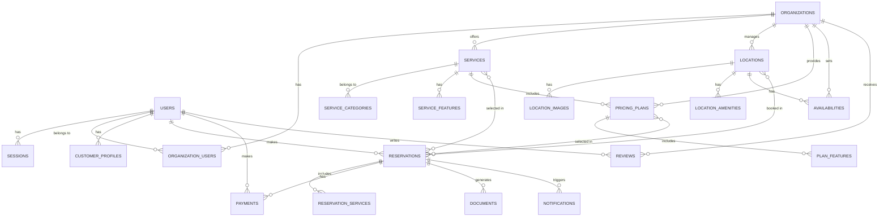

# ERD Design Specification - Funeral Service Platform

## Entity Relationship Diagram Overview



1. USERS Table

```sql
CREATE TABLE users (
    id UUID DEFAULT gen_random_uuid() PRIMARY KEY,
    email VARCHAR(255) UNIQUE NOT NULL,
    phone VARCHAR(20),
    password_hash VARCHAR(255),
    full_name VARCHAR(255) NOT NULL,
    avatar_url TEXT,
    role VARCHAR(50) NOT NULL DEFAULT 'customer',
        -- 'customer', 'provider_admin', 'provider_staff', 'super_admin'
    email_verified BOOLEAN DEFAULT FALSE,
    phone_verified BOOLEAN DEFAULT FALSE,
    is_active BOOLEAN DEFAULT TRUE,
    last_login_at TIMESTAMPTZ,
    metadata JSONB DEFAULT '{}',
    created_at TIMESTAMPTZ DEFAULT NOW(),
    updated_at TIMESTAMPTZ DEFAULT NOW(),
    
    CONSTRAINT valid_role CHECK (role IN ('customer', 'provider_admin', 'provider_staff', 'super_admin'))
);

-- Indexes
CREATE INDEX idx_users_email ON users(email);
CREATE INDEX idx_users_role ON users(role);
CREATE INDEX idx_users_created_at ON users(created_at DESC);
```

2. ORGANIZATIONS Table

```sql
CREATE TABLE organizations (
    id UUID DEFAULT gen_random_uuid() PRIMARY KEY,
    name VARCHAR(255) NOT NULL,
    description TEXT,
    legal_name VARCHAR(255),
    tax_id VARCHAR(50),
    license_number VARCHAR(100),
    email VARCHAR(255) NOT NULL,
    phone VARCHAR(20) NOT NULL,
    website VARCHAR(255),
    logo_url TEXT,
    address JSONB NOT NULL,
        -- {street, city, state, zip_code, country, coordinates: {lat, lng}}
    contact_person VARCHAR(255),
    status VARCHAR(20) DEFAULT 'pending',
        -- 'pending', 'active', 'suspended', 'inactive'
    verification_status VARCHAR(20) DEFAULT 'unverified',
        -- 'unverified', 'pending', 'verified', 'rejected'
    rating DECIMAL(3,2) DEFAULT 0.0,
    total_reviews INTEGER DEFAULT 0,
    settings JSONB DEFAULT '{}',
        -- {notification_settings, booking_settings, payment_settings}
    created_at TIMESTAMPTZ DEFAULT NOW(),
    updated_at TIMESTAMPTZ DEFAULT NOW(),
    
    CONSTRAINT valid_status CHECK (status IN ('pending', 'active', 'suspended', 'inactive')),
    CONSTRAINT valid_verification CHECK (verification_status IN ('unverified', 'pending', 'verified', 'rejected'))
);

-- Indexes
CREATE INDEX idx_orgs_status ON organizations(status);
CREATE INDEX idx_orgs_verification ON organizations(verification_status);
CREATE INDEX idx_orgs_rating ON organizations(rating DESC);
CREATE INDEX idx_orgs_location ON organizations USING GIST (
    ST_SetSRID(ST_MakePoint(
        (address->'coordinates'->>'lng')::FLOAT,
        (address->'coordinates'->>'lat')::FLOAT
    ), 4326)
);
```

3. ORGANIZATION_USERS Table (Many-to-Many)

```sql
CREATE TABLE organization_users (
    id UUID DEFAULT gen_random_uuid() PRIMARY KEY,
    organization_id UUID NOT NULL REFERENCES organizations(id) ON DELETE CASCADE,
    user_id UUID NOT NULL REFERENCES users(id) ON DELETE CASCADE,
    role VARCHAR(50) NOT NULL DEFAULT 'staff',
        -- 'admin', 'manager', 'staff', 'viewer'
    permissions JSONB DEFAULT '{}',
    department VARCHAR(100),
    is_primary_contact BOOLEAN DEFAULT FALSE,
    created_at TIMESTAMPTZ DEFAULT NOW(),
    updated_at TIMESTAMPTZ DEFAULT NOW(),
    
    UNIQUE(organization_id, user_id),
    CONSTRAINT valid_org_role CHECK (role IN ('admin', 'manager', 'staff', 'viewer'))
);

-- Indexes
CREATE INDEX idx_org_users_user_id ON organization_users(user_id);
CREATE INDEX idx_org_users_org_id ON organization_users(organization_id);
CREATE INDEX idx_org_users_role ON organization_users(role);
```

4. SERVICES Table

```sql
CREATE TABLE services (
    id UUID DEFAULT gen_random_uuid() PRIMARY KEY,
    organization_id UUID NOT NULL REFERENCES organizations(id) ON DELETE CASCADE,
    category_id UUID REFERENCES service_categories(id),
    name VARCHAR(255) NOT NULL,
    description TEXT,
    short_description VARCHAR(500),
    service_type VARCHAR(50) NOT NULL,
        -- 'burial', 'cremation', 'transportation', 'ceremony', 'documentation', 'other'
    duration_minutes INTEGER,
        -- Estimated duration in minutes
    requires_specialist BOOLEAN DEFAULT FALSE,
    is_available BOOLEAN DEFAULT TRUE,
    sort_order INTEGER DEFAULT 0,
    metadata JSONB DEFAULT '{}',
        -- {requirements: [], restrictions: [], notes: ''}
    created_at TIMESTAMPTZ DEFAULT NOW(),
    updated_at TIMESTAMPTZ DEFAULT NOW(),
    
    CONSTRAINT valid_service_type CHECK (service_type IN (
        'burial', 'cremation', 'transportation', 'ceremony', 
        'documentation', 'preparation', 'coordination', 'other'
    ))
);

-- Indexes
CREATE INDEX idx_services_org_id ON services(organization_id);
CREATE INDEX idx_services_category ON services(category_id);
CREATE INDEX idx_services_type ON services(service_type);
CREATE INDEX idx_services_available ON services(is_available) WHERE is_available = TRUE;
```

5. SERVICE_CATEGORIES Table

```sql
CREATE TABLE service_categories (
    id UUID DEFAULT gen_random_uuid() PRIMARY KEY,
    name VARCHAR(100) NOT NULL,
    slug VARCHAR(100) UNIQUE NOT NULL,
    description TEXT,
    icon VARCHAR(50),
    sort_order INTEGER DEFAULT 0,
    is_active BOOLEAN DEFAULT TRUE,
    parent_category_id UUID REFERENCES service_categories(id),
    created_at TIMESTAMPTZ DEFAULT NOW()
);

-- Sample categories
-- Burial Services, Cremation Services, Transportation, Documentation, Ceremonial, Preparation
```

6. LOCATIONS Table

```sql
CREATE TABLE locations (
    id UUID DEFAULT gen_random_uuid() PRIMARY KEY,
    organization_id UUID NOT NULL REFERENCES organizations(id) ON DELETE CASCADE,
    name VARCHAR(255) NOT NULL,
    location_type VARCHAR(50) NOT NULL,
        -- 'cemetery', 'crematorium', 'funeral_home', 'church', 'mosque', 'other'
    description TEXT,
    address JSONB NOT NULL,
        -- {street, city, state, zip_code, country, coordinates: {lat, lng}}
    capacity INTEGER,
        -- Maximum capacity for ceremonies
    facilities JSONB DEFAULT '[]',
        -- Array of available facilities
    rules TEXT,
    operating_hours JSONB DEFAULT '{}',
        -- {monday: {open: '08:00', close: '18:00'}, ...}
    is_active BOOLEAN DEFAULT TRUE,
    images JSONB DEFAULT '[]',
        -- Array of image URLs
    features JSONB DEFAULT '{}',
        -- {parking: boolean, accessibility: boolean, chapel: boolean, etc.}
    created_at TIMESTAMPTZ DEFAULT NOW(),
    updated_at TIMESTAMPTZ DEFAULT NOW(),
    
    CONSTRAINT valid_location_type CHECK (location_type IN (
        'cemetery', 'crematorium', 'funeral_home', 'church', 
        'mosque', 'temple', 'memorial_garden', 'other'
    ))
);

-- Spatial Index for geographic queries
CREATE INDEX idx_locations_coordinates ON locations USING GIST (
    ST_SetSRID(ST_MakePoint(
        (address->'coordinates'->>'lng')::FLOAT,
        (address->'coordinates'->>'lat')::FLOAT
    ), 4326)
);

-- Other Indexes
CREATE INDEX idx_locations_org_id ON locations(organization_id);
CREATE INDEX idx_locations_type ON locations(location_type);
CREATE INDEX idx_locations_active ON locations(is_active) WHERE is_active = TRUE;
```

7. PRICING_PLANS Table

```sql
CREATE TABLE pricing_plans (
    id UUID DEFAULT gen_random_uuid() PRIMARY KEY,
    organization_id UUID NOT NULL REFERENCES organizations(id) ON DELETE CASCADE,
    service_id UUID REFERENCES services(id),
    name VARCHAR(255) NOT NULL,
    description TEXT,
    price_type VARCHAR(50) NOT NULL DEFAULT 'fixed',
        -- 'fixed', 'hourly', 'per_person', 'custom'
    base_price DECIMAL(10,2) NOT NULL,
    currency VARCHAR(3) DEFAULT 'USD',
    is_taxable BOOLEAN DEFAULT TRUE,
    tax_rate DECIMAL(5,2) DEFAULT 0.0,
    duration_days INTEGER,
        -- For packages that span multiple days
    is_active BOOLEAN DEFAULT TRUE,
    features JSONB DEFAULT '[]',
        -- Array of included features
    conditions JSONB DEFAULT '{}',
        -- {min_people: int, max_people: int, advance_notice_days: int}
    metadata JSONB DEFAULT '{}',
    created_at TIMESTAMPTZ DEFAULT NOW(),
    updated_at TIMESTAMPTZ DEFAULT NOW(),
    
    CONSTRAINT valid_price_type CHECK (price_type IN ('fixed', 'hourly', 'per_person', 'custom')),
    CONSTRAINT positive_price CHECK (base_price >= 0)
);

-- Indexes
CREATE INDEX idx_pricing_org_id ON pricing_plans(organization_id);
CREATE INDEX idx_pricing_service_id ON pricing_plans(service_id);
CREATE INDEX idx_pricing_active ON pricing_plans(is_active) WHERE is_active = TRUE;
CREATE INDEX idx_pricing_price ON pricing_plans(base_price);
```

8. AVAILABILITIES Table

```sql
CREATE TABLE availabilities (
    id UUID DEFAULT gen_random_uuid() PRIMARY KEY,
    organization_id UUID NOT NULL REFERENCES organizations(id) ON DELETE CASCADE,
    location_id UUID REFERENCES locations(id),
    service_id UUID REFERENCES services(id),
    date DATE NOT NULL,
    start_time TIME NOT NULL,
    end_time TIME NOT NULL,
    max_capacity INTEGER,
    current_bookings INTEGER DEFAULT 0,
    is_available BOOLEAN DEFAULT TRUE,
    slot_type VARCHAR(50) DEFAULT 'regular',
        -- 'regular', 'peak', 'holiday', 'maintenance'
    price_multiplier DECIMAL(3,2) DEFAULT 1.0,
    notes TEXT,
    created_at TIMESTAMPTZ DEFAULT NOW(),
    updated_at TIMESTAMPTZ DEFAULT NOW(),
    
    UNIQUE(organization_id, location_id, service_id, date, start_time),
    CONSTRAINT valid_slot_type CHECK (slot_type IN ('regular', 'peak', 'holiday', 'maintenance')),
    CONSTRAINT valid_time CHECK (end_time > start_time),
    CONSTRAINT valid_capacity CHECK (current_bookings <= max_capacity OR max_capacity IS NULL)
);

-- Indexes
CREATE INDEX idx_avail_org_date ON availabilities(organization_id, date);
CREATE INDEX idx_avail_location ON availabilities(location_id);
CREATE INDEX idx_avail_service ON availabilities(service_id);
CREATE INDEX idx_avail_datetime ON availabilities(date, start_time);
CREATE INDEX idx_avail_available ON availabilities(is_available, date) 
    WHERE is_available = TRUE AND date >= CURRENT_DATE;
```

9. RESERVATIONS Table

```sql
CREATE TABLE reservations (
    id UUID DEFAULT gen_random_uuid() PRIMARY KEY,
    user_id UUID NOT NULL REFERENCES users(id),
    organization_id UUID NOT NULL REFERENCES organizations(id),
    reference_number VARCHAR(50) UNIQUE NOT NULL,
        -- Format: RSV-YYYYMMDD-XXXXX
    status VARCHAR(50) NOT NULL DEFAULT 'draft',
        -- 'draft', 'pending', 'confirmed', 'completed', 'cancelled', 'refunded'
    deceased_person JSONB NOT NULL,
        -- {full_name, date_of_birth, date_of_death, gender, religion, notes}
    ceremony_details JSONB DEFAULT '{}',
        -- {type, date_time, duration_minutes, attendees_count, special_requests}
    location_id UUID REFERENCES locations(id),
    scheduled_date DATE,
    scheduled_time TIME,
    subtotal DECIMAL(10,2) NOT NULL DEFAULT 0.00,
    tax_amount DECIMAL(10,2) DEFAULT 0.00,
    total_amount DECIMAL(10,2) NOT NULL DEFAULT 0.00,
    currency VARCHAR(3) DEFAULT 'USD',
    special_instructions TEXT,
    cancellation_reason TEXT,
    cancellation_date TIMESTAMPTZ,
    metadata JSONB DEFAULT '{}',
    created_at TIMESTAMPTZ DEFAULT NOW(),
    updated_at TIMESTAMPTZ DEFAULT NOW(),
    expires_at TIMESTAMPTZ,
        -- For draft reservations
    
    CONSTRAINT valid_status CHECK (status IN (
        'draft', 'pending', 'confirmed', 'completed', 'cancelled', 'refunded'
    )),
    CONSTRAINT positive_amounts CHECK (subtotal >= 0 AND total_amount >= 0)
);

-- Indexes
CREATE INDEX idx_reservations_user_id ON reservations(user_id);
CREATE INDEX idx_reservations_org_id ON reservations(organization_id);
CREATE INDEX idx_reservations_status ON reservations(status);
CREATE INDEX idx_reservations_ref_num ON reservations(reference_number);
CREATE INDEX idx_reservations_created_at ON reservations(created_at DESC);
CREATE INDEX idx_reservations_scheduled ON reservations(scheduled_date, scheduled_time);
```

10. RESERVATION_SERVICES Table (Many-to-Many)

```sql
CREATE TABLE reservation_services (
    id UUID DEFAULT gen_random_uuid() PRIMARY KEY,
    reservation_id UUID NOT NULL REFERENCES reservations(id) ON DELETE CASCADE,
    service_id UUID NOT NULL REFERENCES services(id),
    pricing_plan_id UUID REFERENCES pricing_plans(id),
    quantity INTEGER DEFAULT 1,
    unit_price DECIMAL(10,2) NOT NULL,
    total_price DECIMAL(10,2) NOT NULL,
    notes TEXT,
    created_at TIMESTAMPTZ DEFAULT NOW(),
    
    UNIQUE(reservation_id, service_id, pricing_plan_id),
    CONSTRAINT positive_quantity CHECK (quantity > 0),
    CONSTRAINT positive_unit_price CHECK (unit_price >= 0)
);

-- Indexes
CREATE INDEX idx_res_services_res_id ON reservation_services(reservation_id);
CREATE INDEX idx_res_services_service_id ON reservation_services(service_id);
```

11. PAYMENTS Table

```sql
CREATE TABLE payments (
    id UUID DEFAULT gen_random_uuid() PRIMARY KEY,
    reservation_id UUID NOT NULL REFERENCES reservations(id),
    user_id UUID NOT NULL REFERENCES users(id),
    payment_method VARCHAR(50) NOT NULL,
        -- 'credit_card', 'debit_card', 'bank_transfer', 'cash', 'other'
    payment_provider VARCHAR(50),
        -- 'stripe', 'paypal', 'bank'
    provider_transaction_id VARCHAR(255),
    amount DECIMAL(10,2) NOT NULL,
    currency VARCHAR(3) DEFAULT 'USD',
    status VARCHAR(50) NOT NULL DEFAULT 'pending',
        -- 'pending', 'processing', 'completed', 'failed', 'refunded', 'cancelled'
    receipt_url TEXT,
    metadata JSONB DEFAULT '{}',
        -- {card_last4, card_brand, billing_address, etc.}
    created_at TIMESTAMPTZ DEFAULT NOW(),
    updated_at TIMESTAMPTZ DEFAULT NOW(),
    completed_at TIMESTAMPTZ,
    
    CONSTRAINT valid_payment_method CHECK (payment_method IN (
        'credit_card', 'debit_card', 'bank_transfer', 'cash', 'check', 'other'
    )),
    CONSTRAINT valid_status CHECK (status IN (
        'pending', 'processing', 'completed', 'failed', 'refunded', 'cancelled'
    )),
    CONSTRAINT positive_amount CHECK (amount > 0)
);

-- Indexes
CREATE INDEX idx_payments_reservation_id ON payments(reservation_id);
CREATE INDEX idx_payments_user_id ON payments(user_id);
CREATE INDEX idx_payments_status ON payments(status);
CREATE INDEX idx_payments_created_at ON payments(created_at DESC);
CREATE INDEX idx_payments_provider_tx_id ON payments(provider_transaction_id);
```

12. DOCUMENTS Table

```sql
CREATE TABLE documents (
    id UUID DEFAULT gen_random_uuid() PRIMARY KEY,
    reservation_id UUID NOT NULL REFERENCES reservations(id) ON DELETE CASCADE,
    document_type VARCHAR(50) NOT NULL,
        -- 'invoice', 'contract', 'receipt', 'death_certificate', 'permit'
    file_url TEXT NOT NULL,
    file_name VARCHAR(255) NOT NULL,
    file_size INTEGER,
    mime_type VARCHAR(100),
    metadata JSONB DEFAULT '{}',
        -- {generated_at, version, language, etc.}
    is_signed BOOLEAN DEFAULT FALSE,
    signed_at TIMESTAMPTZ,
    created_at TIMESTAMPTZ DEFAULT NOW(),
    
    CONSTRAINT valid_document_type CHECK (document_type IN (
        'invoice', 'contract', 'receipt', 'death_certificate', 
        'burial_permit', 'cremation_permit', 'other'
    ))
);

-- Indexes
CREATE INDEX idx_docs_reservation_id ON documents(reservation_id);
CREATE INDEX idx_docs_type ON documents(document_type);
CREATE INDEX idx_docs_created_at ON documents(created_at DESC);
```

13. REVIEWS Table

```sql
CREATE TABLE reviews (
    id UUID DEFAULT gen_random_uuid() PRIMARY KEY,
    reservation_id UUID UNIQUE NOT NULL REFERENCES reservations(id),
    user_id UUID NOT NULL REFERENCES users(id),
    organization_id UUID NOT NULL REFERENCES organizations(id),
    rating INTEGER NOT NULL,
        -- 1 to 5 stars
    title VARCHAR(255),
    comment TEXT,
    is_verified BOOLEAN DEFAULT FALSE,
        -- Whether the reviewer actually used the service
    is_approved BOOLEAN DEFAULT TRUE,
        -- Moderation flag
    response TEXT,
    responded_at TIMESTAMPTZ,
    created_at TIMESTAMPTZ DEFAULT NOW(),
    updated_at TIMESTAMPTZ DEFAULT NOW(),
    
    CONSTRAINT valid_rating CHECK (rating >= 1 AND rating <= 5)
);

-- Indexes
CREATE INDEX idx_reviews_org_id ON reviews(organization_id);
CREATE INDEX idx_reviews_user_id ON reviews(user_id);
CREATE INDEX idx_reviews_rating ON reviews(rating DESC);
CREATE INDEX idx_reviews_created_at ON reviews(created_at DESC);
```

14. NOTIFICATIONS Table

```sql
CREATE TABLE notifications (
    id UUID DEFAULT gen_random_uuid() PRIMARY KEY,
    user_id UUID NOT NULL REFERENCES users(id),
    notification_type VARCHAR(50) NOT NULL,
        -- 'booking_confirmation', 'payment_received', 'reminder', 'status_update'
    title VARCHAR(255) NOT NULL,
    message TEXT NOT NULL,
    metadata JSONB DEFAULT '{}',
        -- {reservation_id, organization_id, action_url, etc.}
    is_read BOOLEAN DEFAULT FALSE,
    read_at TIMESTAMPTZ,
    channel VARCHAR(50) DEFAULT 'in_app',
        -- 'in_app', 'email', 'sms', 'push'
    sent_via JSONB DEFAULT '[]',
        -- Array of channels used
    created_at TIMESTAMPTZ DEFAULT NOW(),
    
    CONSTRAINT valid_notification_type CHECK (notification_type IN (
        'booking_confirmation', 'payment_received', 'reminder', 
        'status_update', 'review_request', 'cancellation'
    )),
    CONSTRAINT valid_channel CHECK (channel IN ('in_app', 'email', 'sms', 'push'))
);

-- Indexes
CREATE INDEX idx_notifications_user_id ON notifications(user_id);
CREATE INDEX idx_notifications_read ON notifications(is_read) WHERE is_read = FALSE;
CREATE INDEX idx_notifications_created_at ON notifications(created_at DESC);
```

## Key Relationships Summary

1. User Management: Hierarchical roles (customer, provider_staff, provider_admin, super_admin)
2. Multi-tenancy: Each organization has isolated data with proper RLS
3. Flexible Pricing: Multiple pricing models (fixed, hourly, per_person)
4. Geospatial Queries: Locations with coordinates for map-based searches
5. Availability Management: Time slots with capacity tracking
6. Document Workflow: From draft to completed reservation with all documents
7. Payment Integration: Multiple payment methods with webhook support
8. Review System: Verified reviews tied to actual reservations

## Performance Considerations

1. Indexing Strategy: Composite indexes for common query patterns
2. Geospatial Indexing: GIST indexes for location-based queries
3. Partial Indexes: For filtering active/available records
4. JSONB Indexing: On frequently queried JSON fields
5. Partitioning: Consider partitioning reservations by created_at for large datasets

This schema supports all required features while maintaining flexibility, security, and performance for a production SaaS platform.

## Enhanced ERD Design with RLS and Partitioning

1. Base RLS Setup Script

```sql
-- Enable RLS on all tables
ALTER TABLE users ENABLE ROW LEVEL SECURITY;
ALTER TABLE organizations ENABLE ROW LEVEL SECURITY;
ALTER TABLE organization_users ENABLE ROW LEVEL SECURITY;
ALTER TABLE services ENABLE ROW LEVEL SECURITY;
ALTER TABLE service_categories ENABLE ROW LEVEL SECURITY;
ALTER TABLE locations ENABLE ROW LEVEL SECURITY;
ALTER TABLE pricing_plans ENABLE ROW LEVEL SECURITY;
ALTER TABLE availabilities ENABLE ROW LEVEL SECURITY;
ALTER TABLE reservations ENABLE ROW LEVEL SECURITY;
ALTER TABLE reservation_services ENABLE ROW LEVEL SECURITY;
ALTER TABLE payments ENABLE ROW LEVEL SECURITY;
ALTER TABLE documents ENABLE ROW LEVEL SECURITY;
ALTER TABLE reviews ENABLE ROW LEVEL SECURITY;
ALTER TABLE notifications ENABLE ROW LEVEL SECURITY;

-- Create helper function for role checking
CREATE OR REPLACE FUNCTION auth_user_role()
RETURNS TEXT AS $$
BEGIN
    RETURN (
        SELECT role 
        FROM users 
        WHERE id = auth.uid()
    );
END;
$$ LANGUAGE plpgsql SECURITY DEFINER;

-- Create function to get user's organization IDs
CREATE OR REPLACE FUNCTION get_user_organization_ids()
RETURNS SETOF UUID AS $$
BEGIN
    RETURN QUERY
    SELECT organization_id 
    FROM organization_users 
    WHERE user_id = auth.uid();
END;
$$ LANGUAGE plpgsql SECURITY DEFINER;
```

2. USERS Table RLS Policies

```sql
-- Users can only view their own profile
CREATE POLICY "Users can view own profile" ON users
    FOR SELECT USING (id = auth.uid());

-- Super admins can view all users
CREATE POLICY "Super admins can view all users" ON users
    FOR SELECT USING (auth_user_role() = 'super_admin');

-- Users can update their own profile (except role and email)
CREATE POLICY "Users can update own profile" ON users
    FOR UPDATE USING (id = auth.uid());

-- Only super admins can change user roles
CREATE POLICY "Only super admins can update roles" ON users
    FOR UPDATE USING (
        auth_user_role() = 'super_admin' 
        OR id = auth.uid()
    );
```

3. ORGANIZATIONS Table RLS Policies

```sql
-- Public can view active organizations
CREATE POLICY "Public can view active organizations" ON organizations
    FOR SELECT USING (
        status = 'active' 
        AND verification_status = 'verified'
    );

-- Organization users can view their organization
CREATE POLICY "Org users can view their organization" ON organizations
    FOR SELECT USING (
        id IN (SELECT * FROM get_user_organization_ids())
    );

-- Organization admins can update their organization
CREATE POLICY "Org admins can update their org" ON organizations
    FOR UPDATE USING (
        id IN (
            SELECT organization_id 
            FROM organization_users 
            WHERE user_id = auth.uid() 
            AND role IN ('admin')
        )
    );

-- Super admins have full access
CREATE POLICY "Super admins have full org access" ON organizations
    FOR ALL USING (auth_user_role() = 'super_admin');
```

4. ORGANIZATION_USERS Table RLS Policies

```sql
-- Users can view their own organization memberships
CREATE POLICY "Users can view own memberships" ON organization_users
    FOR SELECT USING (user_id = auth.uid());

-- Organization admins can view all members in their org
CREATE POLICY "Org admins can view org members" ON organization_users
    FOR SELECT USING (
        organization_id IN (
            SELECT organization_id 
            FROM organization_users 
            WHERE user_id = auth.uid() 
            AND role IN ('admin')
        )
    );

-- Only organization admins can add/remove members
CREATE POLICY "Only org admins can manage members" ON organization_users
    FOR ALL USING (
        organization_id IN (
            SELECT organization_id 
            FROM organization_users 
            WHERE user_id = auth.uid() 
            AND role IN ('admin')
        )
        OR auth_user_role() = 'super_admin'
    );
```

5. SERVICES Table RLS Policies

```sql
-- Public can view active services from active organizations
CREATE POLICY "Public can view active services" ON services
    FOR SELECT USING (
        is_available = TRUE 
        AND organization_id IN (
            SELECT id FROM organizations 
            WHERE status = 'active' 
            AND verification_status = 'verified'
        )
    );

-- Organization users can view all their org's services
CREATE POLICY "Org users can view org services" ON services
    FOR SELECT USING (
        organization_id IN (SELECT * FROM get_user_organization_ids())
    );

-- Organization admins can manage their services
CREATE POLICY "Org admins can manage services" ON services
    FOR ALL USING (
        organization_id IN (
            SELECT organization_id 
            FROM organization_users 
            WHERE user_id = auth.uid() 
            AND role IN ('admin', 'manager')
        )
    );
```

6. LOCATIONS Table RLS Policies

```sql
-- Public can view active locations from active organizations
CREATE POLICY "Public can view active locations" ON locations
    FOR SELECT USING (
        is_active = TRUE 
        AND organization_id IN (
            SELECT id FROM organizations 
            WHERE status = 'active' 
            AND verification_status = 'verified'
        )
    );

-- Organization users can view their org's locations
CREATE POLICY "Org users can view org locations" ON locations
    FOR SELECT USING (
        organization_id IN (SELECT * FROM get_user_organization_ids())
    );

-- Organization admins can manage their locations
CREATE POLICY "Org admins can manage locations" ON locations
    FOR ALL USING (
        organization_id IN (
            SELECT organization_id 
            FROM organization_users 
            WHERE user_id = auth.uid() 
            AND role IN ('admin', 'manager')
        )
    );
```

7. RESERVATIONS Table RLS Policies (Partitioned)

```sql
-- Customers can view their own reservations
CREATE POLICY "Customers can view own reservations" ON reservations
    FOR SELECT USING (
        user_id = auth.uid() 
        OR auth_user_role() = 'super_admin'
    );

-- Customers can create reservations
CREATE POLICY "Customers can create reservations" ON reservations
    FOR INSERT WITH CHECK (
        user_id = auth.uid() 
        AND status = 'draft'
    );

-- Customers can update their draft reservations
CREATE POLICY "Customers can update draft reservations" ON reservations
    FOR UPDATE USING (
        user_id = auth.uid() 
        AND status = 'draft'
    );

-- Organization users can view their organization's reservations
CREATE POLICY "Org users can view org reservations" ON reservations
    FOR SELECT USING (
        organization_id IN (
            SELECT organization_id 
            FROM organization_users 
            WHERE user_id = auth.uid()
        )
        OR auth_user_role() = 'super_admin'
    );

-- Organization admins can update reservations (status changes)
CREATE POLICY "Org admins can update reservations" ON reservations
    FOR UPDATE USING (
        organization_id IN (
            SELECT organization_id 
            FROM organization_users 
            WHERE user_id = auth.uid() 
            AND role IN ('admin', 'manager')
        )
        OR auth_user_role() = 'super_admin'
    );
```

8. PAYMENTS Table RLS Policies

```sql
-- Users can view their own payments
CREATE POLICY "Users can view own payments" ON payments
    FOR SELECT USING (
        user_id = auth.uid() 
        OR auth_user_role() = 'super_admin'
    );

-- Organization users can view payments for their org
CREATE POLICY "Org users can view org payments" ON payments
    FOR SELECT USING (
        reservation_id IN (
            SELECT id FROM reservations 
            WHERE organization_id IN (SELECT * FROM get_user_organization_ids())
        )
        OR auth_user_role() = 'super_admin'
    );

-- Only system can insert payments (via webhooks)
CREATE POLICY "Only system can insert payments" ON payments
    FOR INSERT WITH CHECK (
        auth_user_role() = 'super_admin'
    );
```

9. DOCUMENTS Table RLS Policies

```sql
-- Users can view documents for their reservations
CREATE POLICY "Users can view own documents" ON documents
    FOR SELECT USING (
        reservation_id IN (
            SELECT id FROM reservations 
            WHERE user_id = auth.uid()
        )
        OR auth_user_role() = 'super_admin'
    );

-- Organization users can view documents for their org
CREATE POLICY "Org users can view org documents" ON documents
    FOR SELECT USING (
        reservation_id IN (
            SELECT id FROM reservations 
            WHERE organization_id IN (SELECT * FROM get_user_organization_ids())
        )
        OR auth_user_role() = 'super_admin'
    );

-- Organization admins can upload documents
CREATE POLICY "Org admins can upload documents" ON documents
    FOR INSERT WITH CHECK (
        reservation_id IN (
            SELECT id FROM reservations 
            WHERE organization_id IN (
                SELECT organization_id 
                FROM organization_users 
                WHERE user_id = auth.uid() 
                AND role IN ('admin', 'manager')
            )
        )
        OR auth_user_role() = 'super_admin'
    );
```

10. NOTIFICATIONS Table RLS Policies

```sql
-- Users can only view their own notifications
CREATE POLICY "Users can view own notifications" ON notifications
    FOR SELECT USING (user_id = auth.uid());

-- Users can mark their notifications as read
CREATE POLICY "Users can update own notifications" ON notifications
    FOR UPDATE USING (user_id = auth.uid());

-- System can create notifications for users
CREATE POLICY "System can create notifications" ON notifications
    FOR INSERT WITH CHECK (true);
```

## Table Partitioning Strategy

1. Partitioning Setup Script

```sql
-- Enable partitioning extension
CREATE EXTENSION IF NOT EXISTS pg_partman;

-- Create partitioned tables parent structure
CREATE TABLE reservations_partitioned (
    LIKE reservations INCLUDING ALL,
    CONSTRAINT reservations_partitioned_pkey PRIMARY KEY (id, created_at)
) PARTITION BY RANGE (created_at);

-- Create partition for current month
CREATE TABLE reservations_y2024m01 PARTITION OF reservations_partitioned
    FOR VALUES FROM ('2024-01-01') TO ('2024-02-01');

-- Create default partition
CREATE TABLE reservations_default PARTITION OF reservations_partitioned DEFAULT;

-- Create similar partitioned structure for payments
CREATE TABLE payments_partitioned (
    LIKE payments INCLUDING ALL,
    CONSTRAINT payments_partitioned_pkey PRIMARY KEY (id, created_at)
) PARTITION BY RANGE (created_at);
```

2. Dynamic Partition Creation Function

```sql
-- Function to create monthly partitions automatically
CREATE OR REPLACE FUNCTION create_monthly_partition()
RETURNS void AS $$
DECLARE
    partition_name TEXT;
    start_date DATE;
    end_date DATE;
BEGIN
    -- Create partition for next month
    partition_name := 'reservations_' || to_char(CURRENT_DATE + INTERVAL '1 month', 'yYYYYmMM');
    start_date := date_trunc('month', CURRENT_DATE + INTERVAL '1 month');
    end_date := start_date + INTERVAL '1 month';
    
    EXECUTE format('
        CREATE TABLE IF NOT EXISTS %I PARTITION OF reservations_partitioned
        FOR VALUES FROM (%L) TO (%L)',
        partition_name, start_date, end_date);
    
    -- Create payments partition for next month
    partition_name := 'payments_' || to_char(CURRENT_DATE + INTERVAL '1 month', 'yYYYYmMM');
    
    EXECUTE format('
        CREATE TABLE IF NOT EXISTS %I PARTITION OF payments_partitioned
        FOR VALUES FROM (%L) TO (%L)',
        partition_name, start_date, end_date);
END;
$$ LANGUAGE plpgsql;

-- Schedule partition creation (run via cron or job scheduler)
SELECT create_monthly_partition();
```

3. Partition Maintenance Function

```sql
-- Function to drop old partitions (older than 2 years)
CREATE OR REPLACE FUNCTION drop_old_partitions(years_to_keep INTEGER DEFAULT 2)
RETURNS void AS $$
DECLARE
    partition_table TEXT;
    cutoff_date DATE;
BEGIN
    cutoff_date := CURRENT_DATE - (years_to_keep * INTERVAL '1 year');
    
    -- Drop old reservation partitions
    FOR partition_table IN
        SELECT tablename 
        FROM pg_tables 
        WHERE tablename LIKE 'reservations_y%'
        AND REPLACE(REPLACE(tablename, 'reservations_y', ''), 'm', '-') || '-01' < cutoff_date::text
    LOOP
        EXECUTE format('DROP TABLE IF EXISTS %I CASCADE', partition_table);
        RAISE NOTICE 'Dropped partition: %', partition_table;
    END LOOP;
    
    -- Drop old payment partitions
    FOR partition_table IN
        SELECT tablename 
        FROM pg_tables 
        WHERE tablename LIKE 'payments_y%'
        AND REPLACE(REPLACE(tablename, 'payments_y', ''), 'm', '-') || '-01' < cutoff_date::text
    LOOP
        EXECUTE format('DROP TABLE IF EXISTS %I CASCADE', partition_table);
        RAISE NOTICE 'Dropped partition: %', partition_table;
    END LOOP;
END;
$$ LANGUAGE plpgsql;
```

4. Partitioned Table Definitions with RLS

```sql
-- Recreate RESERVATIONS table with partitioning
DROP TABLE IF EXISTS reservations CASCADE;

CREATE TABLE reservations (
    id UUID DEFAULT gen_random_uuid(),
    user_id UUID NOT NULL,
    organization_id UUID NOT NULL,
    reference_number VARCHAR(50) NOT NULL,
    status VARCHAR(50) NOT NULL DEFAULT 'draft',
    deceased_person JSONB NOT NULL,
    ceremony_details JSONB DEFAULT '{}',
    location_id UUID,
    scheduled_date DATE,
    scheduled_time TIME,
    subtotal DECIMAL(10,2) NOT NULL DEFAULT 0.00,
    tax_amount DECIMAL(10,2) DEFAULT 0.00,
    total_amount DECIMAL(10,2) NOT NULL DEFAULT 0.00,
    currency VARCHAR(3) DEFAULT 'USD',
    special_instructions TEXT,
    cancellation_reason TEXT,
    cancellation_date TIMESTAMPTZ,
    metadata JSONB DEFAULT '{}',
    created_at TIMESTAMPTZ DEFAULT NOW() NOT NULL,
    updated_at TIMESTAMPTZ DEFAULT NOW(),
    expires_at TIMESTAMPTZ,
    
    -- Foreign keys must be recreated on each partition
    CONSTRAINT fk_reservations_user FOREIGN KEY (user_id) REFERENCES users(id),
    CONSTRAINT fk_reservations_organization FOREIGN KEY (organization_id) REFERENCES organizations(id),
    CONSTRAINT fk_reservations_location FOREIGN KEY (location_id) REFERENCES locations(id),
    CONSTRAINT valid_status CHECK (status IN ('draft', 'pending', 'confirmed', 'completed', 'cancelled', 'refunded')),
    CONSTRAINT positive_amounts CHECK (subtotal >= 0 AND total_amount >= 0)
) PARTITION BY RANGE (created_at);

-- Create partitions for each month
CREATE TABLE reservations_y2024m01 PARTITION OF reservations
    FOR VALUES FROM ('2024-01-01 00:00:00') TO ('2024-02-01 00:00:00');

CREATE TABLE reservations_y2024m02 PARTITION OF reservations
    FOR VALUES FROM ('2024-02-01 00:00:00') TO ('2024-03-01 00:00:00');

-- Add indexes to each partition
CREATE INDEX ON reservations_y2024m01 (user_id);
CREATE INDEX ON reservations_y2024m01 (organization_id);
CREATE INDEX ON reservations_y2024m01 (created_at);
CREATE INDEX ON reservations_y2024m01 (scheduled_date);
CREATE INDEX ON reservations_y2024m01 (status);

CREATE INDEX ON reservations_y2024m02 (user_id);
CREATE INDEX ON reservations_y2024m02 (organization_id);
CREATE INDEX ON reservations_y2024m02 (created_at);
CREATE INDEX ON reservations_y2024m02 (scheduled_date);
CREATE INDEX ON reservations_y2024m02 (status);

-- Create default partition
CREATE TABLE reservations_default PARTITION OF reservations DEFAULT;
```

5. Partition-Aware Query Functions

```sql
-- Function to get reservation by ID (handles partitioning)
CREATE OR REPLACE FUNCTION get_reservation_by_id(reservation_uuid UUID)
RETURNS SETOF reservations AS $$
BEGIN
    RETURN QUERY
    SELECT * FROM reservations WHERE id = reservation_uuid;
END;
$$ LANGUAGE plpgsql SECURITY DEFINER;

-- Function for time-range queries (optimized for partitioning)
CREATE OR REPLACE FUNCTION get_reservations_by_date_range(
    start_date TIMESTAMPTZ,
    end_date TIMESTAMPTZ,
    org_id UUID DEFAULT NULL
)
RETURNS TABLE (
    id UUID,
    user_id UUID,
    organization_id UUID,
    reference_number VARCHAR(50),
    status VARCHAR(50),
    scheduled_date DATE,
    total_amount DECIMAL(10,2),
    created_at TIMESTAMPTZ
) AS $$
BEGIN
    RETURN QUERY
    SELECT 
        r.id,
        r.user_id,
        r.organization_id,
        r.reference_number,
        r.status,
        r.scheduled_date,
        r.total_amount,
        r.created_at
    FROM reservations r
    WHERE r.created_at BETWEEN start_date AND end_date
    AND (org_id IS NULL OR r.organization_id = org_id)
    ORDER BY r.created_at DESC;
END;
$$ LANGUAGE plpgsql SECURITY DEFINER;
```

6. Partitioning for AUDIT/LOG Tables

```sql
-- Create audit log table with daily partitioning
CREATE TABLE audit_logs (
    id BIGSERIAL,
    table_name VARCHAR(100) NOT NULL,
    record_id UUID NOT NULL,
    operation VARCHAR(10) NOT NULL,
    old_data JSONB,
    new_data JSONB,
    user_id UUID,
    ip_address INET,
    user_agent TEXT,
    created_at TIMESTAMPTZ DEFAULT NOW() NOT NULL
) PARTITION BY RANGE (created_at);

-- Create daily partitions for audit logs
CREATE TABLE audit_logs_y2024m01d01 PARTITION OF audit_logs
    FOR VALUES FROM ('2024-01-01 00:00:00') TO ('2024-01-02 00:00:00');

-- Function for audit trigger
CREATE OR REPLACE FUNCTION audit_trigger_function()
RETURNS TRIGGER AS $$
BEGIN
    IF TG_OP = 'INSERT' THEN
        INSERT INTO audit_logs (table_name, record_id, operation, new_data, user_id)
        VALUES (TG_TABLE_NAME, NEW.id, 'INSERT', row_to_json(NEW), auth.uid());
        RETURN NEW;
    ELSIF TG_OP = 'UPDATE' THEN
        INSERT INTO audit_logs (table_name, record_id, operation, old_data, new_data, user_id)
        VALUES (TG_TABLE_NAME, NEW.id, 'UPDATE', row_to_json(OLD), row_to_json(NEW), auth.uid());
        RETURN NEW;
    ELSIF TG_OP = 'DELETE' THEN
        INSERT INTO audit_logs (table_name, record_id, operation, old_data, user_id)
        VALUES (TG_TABLE_NAME, OLD.id, 'DELETE', row_to_json(OLD), auth.uid());
        RETURN OLD;
    END IF;
    RETURN NULL;
END;
$$ LANGUAGE plpgsql SECURITY DEFINER;

-- Add audit trigger to reservations
CREATE TRIGGER reservations_audit_trigger
    AFTER INSERT OR UPDATE OR DELETE ON reservations
    FOR EACH ROW EXECUTE FUNCTION audit_trigger_function();
```

7. Partition Maintenance Automation

```sql
-- Create partition management table
CREATE TABLE partition_management (
    id UUID DEFAULT gen_random_uuid() PRIMARY KEY,
    table_name VARCHAR(100) NOT NULL,
    partition_name VARCHAR(100) NOT NULL,
    start_date DATE NOT NULL,
    end_date DATE NOT NULL,
    row_count BIGINT DEFAULT 0,
    size_bytes BIGINT DEFAULT 0,
    last_updated TIMESTAMPTZ DEFAULT NOW(),
    is_active BOOLEAN DEFAULT TRUE
);

-- Automated partition creation (run daily via cron)
CREATE OR REPLACE FUNCTION automate_partition_management()
RETURNS void AS $$
DECLARE
    next_month_start DATE;
    next_month_end DATE;
    partition_suffix TEXT;
BEGIN
    -- Create next month's partitions
    next_month_start := date_trunc('month', CURRENT_DATE + INTERVAL '1 month');
    next_month_end := next_month_start + INTERVAL '1 month';
    partition_suffix := to_char(next_month_start, 'yYYYYmMM');
    
    -- Create reservation partition if not exists
    EXECUTE format('
        CREATE TABLE IF NOT EXISTS reservations_%s PARTITION OF reservations
        FOR VALUES FROM (%L) TO (%L)',
        partition_suffix, next_month_start, next_month_end);
    
    -- Create payment partition if not exists
    EXECUTE format('
        CREATE TABLE IF NOT EXISTS payments_%s PARTITION OF payments
        FOR VALUES FROM (%L) TO (%L)',
        partition_suffix, next_month_start, next_month_end);
    
    -- Update partition management table
    INSERT INTO partition_management (table_name, partition_name, start_date, end_date)
    VALUES 
        ('reservations', 'reservations_' || partition_suffix, next_month_start, next_month_end),
        ('payments', 'payments_' || partition_suffix, next_month_start, next_month_end)
    ON CONFLICT (partition_name) DO NOTHING;
    
    -- Archive old partitions (older than 2 years)
    PERFORM drop_old_partitions(2);
END;
$$ LANGUAGE plpgsql;
```

8. Query Optimization Views

```sql
-- Create view for current month's reservations (hits only one partition)
CREATE VIEW current_month_reservations AS
SELECT * FROM reservations 
WHERE created_at >= date_trunc('month', CURRENT_DATE)
AND created_at < date_trunc('month', CURRENT_DATE) + INTERVAL '1 month';

-- Create view for organization dashboard (partition-aware)
CREATE VIEW organization_dashboard_stats AS
SELECT 
    o.id as organization_id,
    o.name,
    COUNT(r.id) as total_reservations,
    COUNT(r.id) FILTER (WHERE r.status = 'confirmed') as confirmed_reservations,
    COUNT(r.id) FILTER (WHERE r.status = 'completed') as completed_reservations,
    COALESCE(SUM(r.total_amount) FILTER (WHERE r.status IN ('confirmed', 'completed')), 0) as total_revenue,
    COUNT(DISTINCT r.user_id) as unique_customers
FROM organizations o
LEFT JOIN reservations r ON r.organization_id = o.id 
    AND r.created_at >= CURRENT_DATE - INTERVAL '90 days'
WHERE o.status = 'active'
GROUP BY o.id, o.name;
```

## Key Benefits of This Design:

### RLS Benefits:

1. Fine-grained access control based on user roles
2. Data isolation between organizations (multi-tenancy)
3. Security at database level, not just application level
4. Automatic filtering based on user context

### Partitioning Benefits:

1. Improved query performance for time-based queries
2. Efficient data management (archiving, deletion)
3. Parallel query execution across partitions
4. Reduced index size per partition
5. Easier backup/restore of recent data only

### Performance Optimization:

1. Partition pruning for date-range queries
2. Local indexes on each partition
3. Reduced table bloat from old data
4. Efficient vacuum operations on smaller tables

This enhanced design provides enterprise-level security, performance, and scalability for your SaaS platform while maintaining data integrity and compliance requirements.
